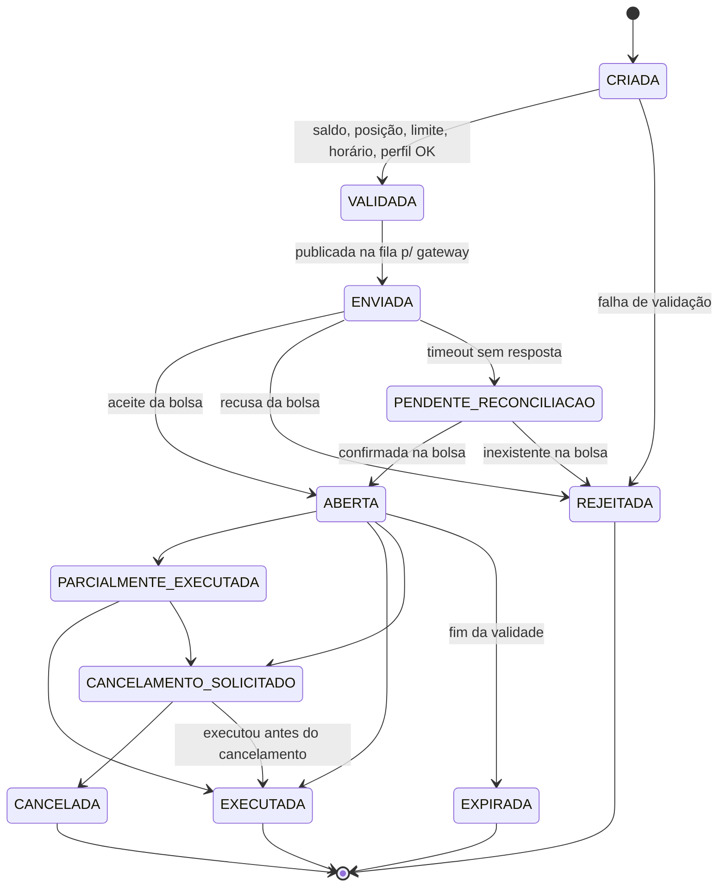

# Requisitos — SentinelTrade

> **Cliente:** Orion Capital (corretora fictícia)
> **Sistema:** SentinelTrade — plataforma de trade de alta criticidade (ações, ETFs e FIIs, com ativos, contas e cotações simuladas)
> **Base:** briefing do cliente + `pesquisaAudiencia.md`
> **Convenções:** cada requisito tem ID, descrição, **justificativa** (ligada a uma dor `D#` ou persona da pesquisa), **critério de aceitação** e prioridade **MoSCoW** (M = Must, S = Should, C = Could).

---

## 1. Visão sistêmica antes da lista

Os requisitos não foram escritos como itens isolados. Eles partem de três ideias que aparecem em toda a pesquisa:

1. **A ordem é o centro do sistema.** Quase todas as dores (D1, D2, D3, D4, D7, D10) acontecem em algum ponto do ciclo de vida de uma ordem. Por isso, a ordem tem uma máquina de estados explícita, um ID único que atravessa todos os serviços e um rastro auditável de cada transição.
2. **"Exatamente uma vez, e provável depois."** A expectativa central da audiência é que o sistema faça o que foi pedido uma única vez e consiga provar isso. Esse princípio amarra idempotência, auditoria, reconciliação e comprovantes.
3. **Falhar de forma segura e transparente.** Indisponibilidade vai acontecer. O sistema deve preferir bloquear operações que não pode validar a aceitar operações arriscadas, e sempre avisar o usuário.

### 1.1 Contexto do sistema

```
          ┌───────────────┐        ┌─────────────────────────────────────────┐
Investidor│ App / Web     │──HTTPS─▶ API Gateway (auth, rate limit, idemp.)  │
 (P1–P4)  └───────────────┘        └──────────────┬──────────────────────────┘
                                                  │
     ┌──────────────┬──────────────┬──────────────┼───────────────┬───────────────┐
     ▼              ▼              ▼              ▼               ▼               ▼
 Identidade     Cadastro/      Cotações       Ordens          Risco/Limites   Notificações
 (MFA, perfis)  Contas/Carteira (cache +     (máquina de      (pré-trade)     (push/e-mail)
                                staleness)    estados)
                                   ▲              │  fila/eventos  │
                                   │              ▼                ▼
                       Provedor de cotações   Gateway Bolsa ◀──▶ Bolsa/Corretora
                           (externo)          (timeout, retry,     simulada
                                               reconciliação)
                                                  │
                                                  ▼
                                   Log de auditoria imutável (append-only)
                                   + Backoffice / Compliance / Suporte
```

### 1.2 Ciclo de vida da ordem (referência para os requisitos)



O estado `PENDENTE_RECONCILIACAO` não existe na lista do briefing, mas foi incluído porque é exatamente o caso que gera a dor D2: quando a bolsa não responde, o sistema **não sabe** se a ordem existe. Reenviar às cegas pode duplicar; descartar pode perder. A resposta correta é consultar e reconciliar.

### 1.3 Perfis de acesso (usados nos requisitos)

| Perfil | Quem | Pode |
|---|---|---|
| `INVESTIDOR` | Personas P1–P4 | Operar a própria conta |
| `SUPORTE` | Atendimento | Consultar dados do cliente (mascarados) e histórico; não opera |
| `OPERADOR` | Mesa/backoffice | Ver todas as ordens, registrar ordem em contingência em nome do cliente (com registro do emissor) |
| `RISCO` | Analista de risco | Configurar limites, bloquear/desbloquear contas e ativos |
| `AUDITOR` | Compliance | Ler logs de auditoria e relatórios; não altera nada |
| `ADMIN` | TI/SRE | Configurar sistema, ativar modo de contingência; não acessa dados financeiros do cliente |

---

## 2. Requisitos Funcionais

### 2.1 Identidade, cadastro e acesso

| ID | Requisito | Descrição | Justificativa | Critério de aceitação | Prior. |
|---|---|---|---|---|---|
| **RF-01** | Cadastro de investidor | Permitir cadastrar investidor com dados pessoais, documento, contato e conta vinculada; permitir atualização e inativação (sem exclusão física de dados com histórico de ordens). | Base de tudo. A inativação sem exclusão preserva o histórico exigido para auditoria (D10, CVM 35). | Investidor criado com status `PENDENTE`, `ATIVO`, `BLOQUEADO` ou `INATIVO`; tentativa de excluir investidor com ordens retorna erro e sugere inativação. | M |
| **RF-02** | Perfil de investidor (suitability) | Registrar questionário de perfil (conservador, moderado, arrojado), data da avaliação e data de vencimento. | Persona Juliana quer saber se o produto é adequado; a CVM 30 exige verificação de adequação. | Conta sem perfil válido só pode consultar dados; perfil vencido gera aviso de reavaliação. | S |
| **RF-03** | Autenticação com MFA | Login com senha + segundo fator (TOTP ou push no app). O segundo fator é obrigatório para login em dispositivo novo e para ações sensíveis (troca de senha, troca de contato, cadastro de dispositivo). | D5: Brasil é o 2º país em tentativas de fraude; 1 em cada 3 brasileiros já sofreu golpe. MFA reduz o impacto de senha vazada. | Login sem segundo fator válido nunca gera sessão; ações sensíveis pedem novo fator mesmo com sessão ativa. | M |
| **RF-04** | Gestão de dispositivos e sessões | Listar dispositivos e sessões ativas, permitir encerrar remotamente e notificar acesso a partir de dispositivo novo. | D5 + persona Dona Marta: golpes de engenharia social e troca de celular. Permite ao próprio usuário detectar e cortar acesso indevido. | Acesso em dispositivo novo dispara notificação em até 1 min; encerrar sessão invalida o token imediatamente. | M |
| **RF-05** | Controle de acesso por perfil | Autorizar cada operação com base no perfil (seção 1.3) e na titularidade da conta. | Atende "controle de acesso por perfil" (lista do professor). Evita que suporte opere ou que um investidor veja outra conta. | Testes automatizados para cada par perfil × endpoint; acesso negado gera evento de auditoria. | M |
| **RF-06** | Recuperação de acesso segura | Recuperação de senha com verificação de identidade e período de carência para operações após troca de credenciais. | D5: a recuperação de conta é a porta preferida em golpes de engenharia social. Carência limita o dano de uma tomada de conta. | Após recuperação, envio de ordens fica bloqueado por janela configurável e o investidor é notificado em todos os canais cadastrados. | S |

### 2.2 Conta, carteira e cotações

| ID | Requisito | Descrição | Justificativa | Critério de aceitação | Prior. |
|---|---|---|---|---|---|
| **RF-07** | Consulta de saldo | Exibir saldo **disponível**, **bloqueado** (reservado por ordens abertas) e **total**. | D3/D7: usuários não entendem por que o saldo "sumiu" após enviar ordem. Separar disponível de bloqueado explica isso. | Após ordem de compra aberta, o valor estimado passa de disponível para bloqueado; ao cancelar, volta. | M |
| **RF-08** | Consulta de carteira | Exibir posições por ativo: quantidade total, quantidade disponível para venda, preço médio, valor atual e resultado (R$ e %). | Persona Lucas quer saber "quanto tenho e quanto ganhei"; quantidade disponível evita venda de algo já comprometido em outra ordem. | Valores batem com a soma das execuções registradas (verificável por reconciliação RF-21). | M |
| **RF-09** | Consulta de cotações | Exibir último preço, variação, máxima, mínima, volume e **horário da última atualização** de cada ativo; permitir lista de acompanhamento. | Funcionalidade central do briefing. O horário visível ataca D6. | Cada cotação exibe timestamp; lista de acompanhamento persiste entre sessões. | M |
| **RF-10** | Sinalização de cotação desatualizada | Marcar visualmente a cotação como **desatualizada** quando passar do limite de frescor (RNF-DES-02) e impedir ordens a mercado com base nela. | D6: decisões sobre preço velho causam prejuízo e reclamação. Persona Rafael precisa saber quando não confiar no dado. | Com o provedor parado, a tela mostra o aviso e o botão de ordem a mercado fica desabilitado com explicação. | M |
| **RF-11** | Cadastro de ativos | Manter ativos negociáveis (ticker, tipo: ação/ETF/FII, lote padrão, tick de preço, situação: negociável/suspenso). | Validação de ordem depende disso (lote, tick, suspensão). | Ordem para ativo suspenso é rejeitada na validação com motivo claro. | M |

### 2.3 Ordens

| ID | Requisito | Descrição | Justificativa | Critério de aceitação | Prior. |
|---|---|---|---|---|---|
| **RF-12** | Envio de ordem de compra e venda | Permitir ordem **a mercado** e **limitada**, com quantidade, preço (se limitada) e validade (do dia / até cancelar, conforme regras da corretora). | Funcionalidade central. Tipos e validade de ordem são itens que a CVM 35 exige nas regras da corretora. | Ordem criada recebe ID único e número sequencial, com status `CRIADA`. | M |
| **RF-13** | Revisão e confirmação antes do envio | Mostrar resumo (ativo, lado, qtd, preço, valor estimado, saldo após) e exigir confirmação explícita; alertar quando qtd ou valor fogem muito do padrão do cliente ou do preço atual. | D8 + persona Lucas: erro de digitação ("fat finger") é causa clássica de prejuízo. | Ordem com preço limitado distante mais que X% da última cotação ou valor acima de Y% do patrimônio exige confirmação reforçada. | M |
| **RF-14** | Validação pré-negociação | Antes de transmitir, validar: (a) saldo disponível para compra; (b) quantidade disponível para venda; (c) limites de risco do cliente; (d) ativo negociável; (e) mercado aberto ou em fase que aceita ordens; (f) lote e tick; (g) adequação ao perfil. | Lista do professor + D7 + CVM 35 (monitorar ordens que excedam limites). Rejeitar internamente é mais barato e mais claro que rejeitar na bolsa. | Cada regra tem teste; falha retorna **código e mensagem em linguagem simples** (ex.: "Saldo insuficiente: faltam R$ 120,00"). | M |
| **RF-15** | Operação fora do perfil com ciência | Quando a operação for inadequada ao perfil, exigir aceite explícito e registrar esse aceite. | CVM 30 permite operar fora do perfil desde que haja ciência registrada; persona Juliana. | Aceite fica gravado na auditoria vinculado ao ID da ordem. | S |
| **RF-16** | Reserva de saldo e posição | Ao validar, bloquear o valor (compra) ou a quantidade (venda) atomicamente; liberar no cancelamento, rejeição ou expiração; consumir na execução. | Sem reserva, duas ordens simultâneas podem usar o mesmo saldo (D2/D7). | Duas ordens concorrentes que somadas excedem o saldo: exatamente uma é aceita. | M |
| **RF-17** | Cancelamento de ordem | Permitir solicitar cancelamento de ordem `ABERTA` ou `PARCIALMENTE_EXECUTADA`; o estado final depende da confirmação da bolsa. | Lista do professor. O estado intermediário `CANCELAMENTO_SOLICITADO` evita prometer um cancelamento que a bolsa ainda não confirmou. | Se a ordem executar antes do cancelamento chegar, o estado final é `EXECUTADA` e o usuário é avisado. | M |
| **RF-18** | Alteração de ordem | Permitir alterar preço e quantidade de ordem aberta (implementado como cancelar + nova ordem, ou modificação, conforme a bolsa simulada). | Prevista no contexto do briefing e nas regras de corretora da CVM 35. | Alteração gera evento de auditoria com valores antes/depois. | S |
| **RF-19** | Acompanhamento do status da ordem | Exibir o estado atual e a linha do tempo de transições, com execuções parciais (qtd e preço de cada uma). | D3: iniciantes não distinguem "enviada" de "executada"; Rafael precisa do estado em tempo quase real. | Mudança de estado aparece na tela em até 2 s (RNF-DES-03); cada estado tem texto explicativo. | M |
| **RF-20** | Proteção contra ordem duplicada | Cada envio carrega uma **chave de idempotência** gerada pelo cliente; requisições repetidas com a mesma chave retornam a ordem já criada, sem criar outra. | D2: rede instável → usuário toca duas vezes → duas ordens. Lista do professor ("proteção contra reenvio/duplicidade"). | Repetir 10× o mesmo POST com a mesma chave resulta em 1 ordem; a mesma chave com conteúdo diferente é rejeitada. | M |
| **RF-21** | Reconciliação com a bolsa | Processo que compara ordens/execuções internas com as da bolsa simulada: resolve ordens em `PENDENTE_RECONCILIACAO` e detecta divergências. | D2/D10: depois de um timeout, o sistema precisa descobrir a verdade em vez de chutar. A dor da Orion é justamente a falta de rastreabilidade. | Ordens em `PENDENTE_RECONCILIACAO` são resolvidas em até 5 min; divergência abre alerta para backoffice. | M |
| **RF-22** | Ordem em contingência (backoffice) | Permitir ao `OPERADOR` registrar ordem em nome do cliente quando o canal digital estiver indisponível, com identificação do emissor e do canal. | Regulação exige informar meio alternativo de envio quando a ferramenta cai (D1); CVM 35 exige identificar o emissor. | Ordem de contingência mostra `canal=MESA` e `emissor=<operador>` na auditoria. | S |

### 2.4 Notificações, histórico e auditoria

| ID | Requisito | Descrição | Justificativa | Critério de aceitação | Prior. |
|---|---|---|---|---|---|
| **RF-23** | Notificações de ordem | Notificar execução (total/parcial), rejeição (com motivo), cancelamento, expiração e falha. | Lista do professor; D3. | Notificação enviada em até 5 s da mudança de estado (em operação normal). | M |
| **RF-24** | Notificações de segurança e de sistema | Notificar login em novo dispositivo, troca de dados sensíveis, indisponibilidade/contingência e retorno à normalidade; notificações **nunca** pedem senha, código ou link para login. | D5 (engenharia social) e D1 (falta de comunicação em incidentes). Regra fixa de conteúdo ajuda o usuário a reconhecer golpes. | Template de notificação validado contra lista de termos proibidos ("informe seu código", etc.). | M |
| **RF-25** | Preferências de notificação | Permitir escolher canais e tipos (exceto notificações de segurança, que são obrigatórias); alertas de oscilação relevante configuráveis por ativo. | Persona Juliana quer relevância, não spam; o briefing cita oscilação relevante. | Usuário consegue desligar alertas de preço, mas não consegue desligar alertas de segurança. | S |
| **RF-26** | Histórico de operações | Consultar ordens e execuções por período, ativo, tipo e estado; exportar (CSV/PDF). | Lista do professor; Dona Marta precisa de comprovantes para conferência e imposto. | Exportação contém ID da ordem, timestamps de cada transição e preços executados. | M |
| **RF-27** | Comprovante de ordem | Gerar comprovante por ordem com toda a linha do tempo, incluindo tentativas e rejeições. | D4: para pedir ressarcimento (MRP) o investidor precisa provar datas, horários e o que aconteceu. Reduz disputa com o suporte. | Comprovante é gerado a partir do log de auditoria e inclui um hash de verificação. | S |
| **RF-28** | Registro de auditoria | Registrar todo evento relevante: login/logout, falhas de autenticação, mudanças cadastrais, criação/transição de ordem, alteração de limites, acesso negado, ações de operador e admin. Cada evento: quem, o quê, quando (UTC), de onde (IP/dispositivo), ID de correlação e resultado. | Lista do professor; D10 (dor central da Orion); CVM 35 (registro com data/hora, sequência e emissor). | Para qualquer ordem, é possível reconstruir toda a história apenas pelo log. | M |
| **RF-29** | Consulta de auditoria | Perfil `AUDITOR` pode consultar e exportar logs por usuário, ordem, período e tipo de evento, sem permissão de escrita. | Compliance precisa responder a CVM/BSM sem depender da TI. | Consulta por ID de ordem retorna todos os eventos correlacionados em ordem cronológica. | M |

### 2.5 Risco e operação

| ID | Requisito | Descrição | Justificativa | Critério de aceitação | Prior. |
|---|---|---|---|---|---|
| **RF-30** | Gestão de limites de risco | `RISCO` configura limites por cliente (valor máximo por ordem, exposição diária, concentração por ativo) e por ativo (bloqueio). | Briefing ("limites financeiros"), CVM 35 (limites operacionais por cliente), D9 (proteger quem opera em excesso). | Alteração de limite vale para novas ordens imediatamente e fica auditada com valor anterior e novo. | M |
| **RF-31** | Painel de acompanhamento de ordens | Visão para `OPERADOR`/`RISCO` de ordens por estado, rejeições por motivo, ordens pendentes de reconciliação e divergências. | D10: hoje os sistemas da Orion não permitem ver o ciclo das ordens de forma integrada. | Filtro por estado, cliente e ativo; destaque para ordens paradas há mais de N minutos. | S |
| **RF-32** | Controle de modo de contingência | `ADMIN` (ou o próprio sistema, automaticamente) coloca a plataforma em modo de indisponibilidade segura (ver RNF-RES-05) e informa os usuários. | D1: quando falhar, falhar de forma controlada e comunicada. | Ao ativar, novas ordens são recusadas com mensagem e canal alternativo; consultas continuam funcionando com dados marcados como "última atualização às HH:MM". | M |
| **RF-33** | Calendário e fases de mercado | Manter calendário de pregão, feriados e fases (pré-abertura, negociação, leilão, fechado), usado pela validação. | RF-14 (e) depende disso; CVM 35 exige regras de horário de recebimento de ordens. | Ordem enviada em feriado é rejeitada com mensagem indicando o próximo pregão. | M |

---

## 3. Requisitos Não Funcionais

> **Nota sobre metas numéricas:** os valores abaixo são **metas propostas** para o protótipo, escolhidas a partir das dores da audiência. Elas devem ser revisadas com a Orion e medidas em testes de carga e caos.

### 3.1 Segurança

| ID | Requisito | Descrição / Critério | Justificativa | Prior. |
|---|---|---|---|---|
| **RNF-SEG-01** | Senhas protegidas por hash | Senhas armazenadas apenas com algoritmo de hash adaptativo e salt (Argon2id ou bcrypt); nunca em texto ou com hash rápido (MD5/SHA-1). | Lista do professor; vazamento de base não deve expor senhas (D5). | M |
| **RNF-SEG-02** | MFA | Segundo fator obrigatório conforme RF-03; segredos TOTP criptografados; limite de tentativas e bloqueio progressivo. | D5. | M |
| **RNF-SEG-03** | Criptografia | TLS 1.2+ em todo tráfego externo e interno; dados sensíveis em repouso criptografados (AES-256); chaves em cofre (KMS/Vault). | Confidencialidade; LGPD. | M |
| **RNF-SEG-04** | Atributos privados e encapsulamento | Entidades de domínio (Conta, Ordem, Carteira) expõem estado apenas por métodos que preservam invariantes (ex.: saldo só muda via operações de débito/crédito/reserva); sem setters públicos para campos financeiros. | Lista do professor. Impede que qualquer camada altere saldo ou estado da ordem sem passar pela regra. | M |
| **RNF-SEG-05** | Validação de entradas | Toda entrada validada no servidor por esquema (tipo, faixa, formato, tamanho); valores monetários com tipo decimal (nunca float). | Lista do professor; float em dinheiro gera erro de arredondamento (integridade). | M |
| **RNF-SEG-06** | Prevenção de injeção | Consultas parametrizadas/ORM; escape de saída; proibição de montagem de comandos/queries por concatenação; análise estática (SAST) no pipeline. | Lista do professor. | M |
| **RNF-SEG-07** | Tratamento seguro de exceções | Erros ao usuário com mensagem amigável e código, sem stack trace, SQL ou detalhe interno; detalhe técnico só no log interno com ID de correlação. | Lista do professor; também atende D3 (mensagens compreensíveis). | M |
| **RNF-SEG-08** | Proteção contra reenvio e replay | Idempotência (RF-20) + tokens de sessão com expiração curta + proteção CSRF + nonce/timestamp em requisições críticas. | Lista do professor; D2. | M |
| **RNF-SEG-09** | Ausência de segredos no repositório | Nenhuma senha, chave ou token no código; uso de variáveis de ambiente/cofre; varredura de segredos (ex.: gitleaks) bloqueando o merge. | Lista do professor. | M |
| **RNF-SEG-10** | Menor privilégio e segregação de funções | Cada perfil e cada serviço tem apenas as permissões necessárias; `ADMIN` não acessa dados financeiros; quem configura limite não aprova a própria alteração em produção (quatro olhos). | Reduz fraude interna e o impacto de credencial comprometida. | S |
| **RNF-SEG-11** | Rate limiting e detecção de abuso | Limitar tentativas de login e envio de ordens por conta/IP; detectar padrões anômalos (muitas ordens em segundos, login de local incomum). | D5; protege a plataforma contra força bruta e bots. | S |
| **RNF-SEG-12** | Privacidade (LGPD) | Minimização de dados; mascaramento de CPF e contato em telas de suporte e em logs; dados pessoais separados dos eventos financeiros. | LGPD; perfil `SUPORTE` não precisa ver dados completos. | M |

### 3.2 Resiliência

| ID | Requisito | Descrição / Critério | Justificativa | Prior. |
|---|---|---|---|---|
| **RNF-RES-01** | Time-out de integração | Toda chamada externa (bolsa, provedor de cotações, notificação) tem timeout explícito (proposta: 2 s para envio de ordem, 1 s para cotação); nenhuma thread espera indefinidamente. | Lista do professor; sem timeout, uma integração lenta derruba o sistema inteiro (D1). | M |
| **RNF-RES-02** | Retentativa controlada | Retentativas com backoff exponencial e jitter, número máximo (proposta: 3) e **apenas para operações idempotentes**; envio de ordem não é reenviado às cegas — após timeout vai para `PENDENTE_RECONCILIACAO` (RF-21). | Lista do professor. Retentar sem idempotência é exatamente o que causa ordem duplicada (D2). | M |
| **RNF-RES-03** | Idempotência ponta a ponta | Chave de idempotência do cliente (RF-20) e ID da ordem propagados até o gateway da bolsa (como ID de ordem do cliente), para que a própria bolsa também rejeite duplicatas. | Lista do professor; garante "exatamente uma vez" mesmo com retentativas em várias camadas. | M |
| **RNF-RES-04** | Fila de mensagens para processamento assíncrono | Ordens validadas são publicadas em fila durável; o gateway consome, envia e publica eventos de retorno. Uso de padrão *outbox* para gravar a ordem e o evento na mesma transação. | Lista do professor. Desacopla a aceitação da ordem da disponibilidade da bolsa e absorve picos de abertura e fechamento (persona Rafael). O outbox evita "ordem gravada mas evento perdido". | M |
| **RNF-RES-05** | Modo de indisponibilidade segura | Disjuntor (*circuit breaker*) por integração. Se a bolsa ou o provedor de cotações falhar acima do limiar, o sistema: bloqueia **novas** ordens com mensagem clara, mantém consultas com dado marcado como desatualizado, mantém cancelamentos enfileirados e exibe canal alternativo (RF-22). | Lista do professor; D1. Melhor recusar com transparência do que aceitar ordem que não pode ser validada. | M |
| **RNF-RES-06** | Recuperação de falhas | Serviços sem estado e reiniciáveis; após queda, o processamento retoma da fila sem perda nem duplicação. **RPO = 0** para ordens confirmadas ao usuário; **RTO ≤ 5 min** para o fluxo de ordens. | Lista do professor; uma ordem que o usuário viu como "criada" nunca pode sumir. | M |
| **RNF-RES-07** | Consistência de dados | Operações financeiras (reserva, execução, liberação) em transações ACID; transições de estado da ordem validadas (só as do diagrama 1.2); controle de concorrência otimista por versão. Consistência eventual é aceita apenas em leituras (ex.: painel), nunca em saldo. | Lista do professor; D2/D7 (duas ordens com o mesmo saldo). | M |
| **RNF-RES-08** | Sem ponto único de falha | Pelo menos 2 réplicas de cada serviço crítico, banco com réplica e failover automático, fila replicada. | Disponibilidade no pregão (D1). | S |
| **RNF-RES-09** | Testes de falha | Testes automatizados que simulam: bolsa lenta, bolsa fora, provedor de cotação parado, mensagem duplicada na fila, queda de serviço no meio de uma ordem. | Garante que os mecanismos acima funcionam de verdade, não só no papel. | S |

### 3.3 Qualidade

| ID | Atributo | Descrição / Critério | Justificativa | Prior. |
|---|---|---|---|---|
| **RNF-AUD-01** | Auditabilidade | Log de auditoria **append-only** e imutável: sem update/delete; cada registro encadeado com o hash do anterior (cadeia de hashes) para detectar adulteração; retenção mínima de 5 anos. | Lista do professor; D4, D10; CVM 35 e MRP dependem de registros confiáveis. | M |
| **RNF-AUD-02** | Separação do log | O log de auditoria fica em armazenamento separado, com credenciais próprias; nenhum serviço de negócio tem permissão de apagar. | Se o mesmo usuário que opera o banco pode apagar o log, o log não prova nada. | M |
| **RNF-CON-01** | Confidencialidade | Dados de um investidor só visíveis a ele e aos perfis autorizados (RF-05); dados sensíveis mascarados em logs e telas internas (RNF-SEG-12). | Lista do professor; LGPD. | M |
| **RNF-INT-01** | Integridade | Valores monetários em decimal com precisão fixa; invariantes verificadas (saldo ≥ 0, quantidade disponível ≥ 0, soma das execuções = quantidade executada); reconciliação diária de saldos e posições com zero divergência não explicada. | Lista do professor; D2 (relatos de ordem invertida e posição dobrada). | M |
| **RNF-DIS-01** | Disponibilidade | ≥ 99,9% **durante o horário de pregão** para login, consulta e envio de ordens; ≥ 99,5% fora dele. Manutenções planejadas só fora do pregão. | Lista do professor. A pesquisa mostra que o que dói é cair no pregão, não de madrugada (D1). | M |
| **RNF-DES-01** | Desempenho — ordem | Do envio pelo usuário até o estado `VALIDADA`/`REJEITADA`: p95 ≤ 300 ms; até `ENVIADA`: p95 ≤ 500 ms, com 1.000 ordens/s. | Persona Rafael; latência alta gera reenvio (D2). | M |
| **RNF-DES-02** | Desempenho — cotação | Cotação atualizada na tela em até 1 s após chegar do provedor; dado considerado **desatualizado** após 5 s sem atualização em pregão. | D6; alimenta RF-10. | M |
| **RNF-DES-03** | Desempenho — status | Mudança de estado da ordem visível ao usuário em até 2 s (push/WebSocket). | D3. | S |
| **RNF-ESC-01** | Escalabilidade | Escala horizontal dos serviços de ordens, cotações e notificações; suportar 5× a carga média nos picos de abertura e fechamento sem violar RNF-DES-01. | A base de investidores cresce (6,45 mi de contas) e a carga se concentra em poucos minutos. | S |
| **RNF-RAS-01** | Rastreabilidade | ID de correlação gerado na entrada e propagado por todos os serviços, filas e logs; todo evento de uma ordem carrega o ID da ordem. Tracing distribuído (ex.: OpenTelemetry). | Lista do professor; D10: hoje a Orion não consegue seguir uma ordem entre sistemas. | M |
| **RNF-RAS-02** | Rastreabilidade de requisitos | Cada requisito tem ID referenciado em casos de teste e no código (ver matriz na seção 4). | Facilita auditoria do próprio projeto e manutenção. | S |
| **RNF-MAN-01** | Manutenibilidade | Arquitetura em serviços com responsabilidade única; domínio separado de infraestrutura; cobertura de testes ≥ 80% nas regras de validação e na máquina de estados; regras de negócio parametrizáveis (limites, horários, tick) sem novo deploy. | Lista do professor; regras regulatórias mudam e precisam ser ajustadas rápido. | M |
| **RNF-OBS-01** | Observabilidade | Métricas (latência, taxa de rejeição, ordens pendentes, estado dos disjuntores), logs estruturados e alertas para SRE; painel de saúde por integração. | Permite detectar problema antes do cliente (D1). | S |
| **RNF-USA-01** | Usabilidade | Mensagens de erro e estados de ordem em linguagem simples; fluxo de ordem em no máximo 3 passos; confirmação clara (RF-13). | Personas Lucas e Dona Marta (D3, D8). | M |
| **RNF-USA-02** | Acessibilidade | Conformidade com WCAG 2.1 nível AA (contraste, tamanho de fonte ajustável, navegação por teclado, leitor de tela). | Público 60+ cresce e detém quase metade do estoque (D8). | S |
| **RNF-USA-03** | Design responsável | Sem elementos de gamificação que incentivem operar mais (confetes, streaks, rankings); exibir alertas de risco em operações alavancadas ou concentradas. | D9: dados de perdas em day trade e fiscalização de apps "gamificados". | S |
| **RNF-CONF-01** | Conformidade | Regras de atuação (tipos de ordem, horários, validade, cancelamento) documentadas e parametrizadas conforme a CVM 35; suitability conforme CVM 30; tratamento de dados conforme LGPD. | Mesmo em ambiente simulado, a arquitetura deve estar pronta para operação real. | S |

---

## 4. Matriz de rastreabilidade: dores → requisitos

| Dor (pesquisa) | Requisitos que a tratam |
|---|---|
| **D1** Indisponibilidade | RF-22, RF-24, RF-32, RNF-RES-01, RNF-RES-05, RNF-RES-06, RNF-RES-08, RNF-DIS-01, RNF-ESC-01, RNF-OBS-01 |
| **D2** Integridade / duplicidade | RF-16, RF-20, RF-21, RNF-SEG-08, RNF-RES-02, RNF-RES-03, RNF-RES-04, RNF-RES-07, RNF-INT-01 |
| **D3** Transparência do estado | RF-07, RF-19, RF-23, RNF-DES-03, RNF-SEG-07, RNF-USA-01 |
| **D4** Prova e ressarcimento | RF-26, RF-27, RF-28, RNF-AUD-01, RNF-AUD-02 |
| **D5** Fraude e acesso indevido | RF-03, RF-04, RF-06, RF-24, RNF-SEG-01, RNF-SEG-02, RNF-SEG-11 |
| **D6** Cotação desatualizada | RF-09, RF-10, RNF-DES-02, RNF-RES-05 |
| **D7** Validação insuficiente | RF-11, RF-14, RF-16, RF-30, RF-33 |
| **D8** Usabilidade / acessibilidade | RF-13, RNF-USA-01, RNF-USA-02 |
| **D9** Comportamento de risco | RF-15, RF-30, RNF-USA-03 |
| **D10** Sistemas pouco integrados (Orion) | RF-21, RF-28, RF-29, RF-31, RNF-RAS-01, RNF-AUD-01 |

### 4.1 Cobertura da lista sugerida pelo professor

| Item obrigatório | Requisito(s) |
|---|---|
| Cadastro e gestão de investidores | RF-01, RF-02 |
| Autenticação com MFA | RF-03, RNF-SEG-02 |
| Consulta de carteira | RF-08 |
| Consulta de cotações | RF-09, RF-10 |
| Envio de ordem de compra e venda | RF-12, RF-13 |
| Cancelamento de ordem | RF-17 |
| Validação de saldo, posição e limites | RF-14, RF-16, RF-30 |
| Acompanhamento do status da ordem | RF-19 |
| Notificações | RF-23, RF-24, RF-25 |
| Consulta de histórico | RF-26 |
| Auditoria | RF-28, RF-29 |
| Senhas com hash | RNF-SEG-01 |
| Controle de acesso por perfil | RF-05 |
| Atributos privados | RNF-SEG-04 |
| Validação de entradas | RNF-SEG-05 |
| Tratamento seguro de exceções | RNF-SEG-07 |
| Prevenção de injeção | RNF-SEG-06 |
| Proteção contra reenvio/duplicidade | RF-20, RNF-SEG-08 |
| Ausência de segredos no repositório | RNF-SEG-09 |
| Time-out de integração | RNF-RES-01 |
| Retentativa controlada | RNF-RES-02 |
| Idempotência | RNF-RES-03 |
| Fila de mensagens | RNF-RES-04 |
| Modo de indisponibilidade segura | RNF-RES-05, RF-32 |
| Recuperação de falhas | RNF-RES-06 |
| Consistência de dados | RNF-RES-07 |
| Auditabilidade | RNF-AUD-01, RNF-AUD-02 |
| Confidencialidade | RNF-CON-01 |
| Integridade | RNF-INT-01 |
| Disponibilidade | RNF-DIS-01 |
| Desempenho | RNF-DES-01, RNF-DES-02, RNF-DES-03 |
| Rastreabilidade | RNF-RAS-01, RNF-RAS-02 |
| Manutenibilidade | RNF-MAN-01 |

---

## 5. Como os requisitos se reforçam (e onde há tensão)

Pensar de forma sistêmica significa olhar as relações, não só os itens.

### 5.1 Cadeias de reforço

- **Timeout → Retentativa → Idempotência → Reconciliação.** Timeout (RNF-RES-01) evita travar; mas um timeout no envio deixa a dúvida "a ordem chegou?". Retentar sem idempotência (RNF-RES-02/03) duplicaria; por isso o envio de ordem não é retentado às cegas e vai para reconciliação (RF-21). Os quatro requisitos só funcionam juntos.
- **Fila + Outbox + Consistência.** A fila (RNF-RES-04) absorve o pico do pregão, mas introduz o risco de gravar a ordem e perder o evento. O outbox e as transações ACID (RNF-RES-07) fecham esse buraco.
- **ID de correlação → Auditoria → Comprovante.** O mesmo identificador (RNF-RAS-01) que permite à TI depurar permite ao compliance auditar (RF-29) e ao investidor provar o que aconteceu (RF-27). Uma decisão técnica atende três personas.
- **MFA + Notificação de segurança + Regras de conteúdo.** MFA (RF-03) sozinho não resolve engenharia social; combinado com alertas de dispositivo novo (RF-04) e notificações que nunca pedem código (RF-24), cria um padrão que o usuário aprende a reconhecer.

### 5.2 Tensões e como foram resolvidas

| Tensão | Decisão |
|---|---|
| **Disponibilidade × Integridade** | Em caso de dúvida, integridade vence: o modo de indisponibilidade segura (RNF-RES-05) recusa novas ordens em vez de aceitá-las sem validação. Consultas continuam disponíveis. |
| **Segurança × Usabilidade** (MFA, confirmações) | MFA forte no login e em ações sensíveis, mas não a cada ordem; confirmação reforçada só quando a ordem foge do padrão (RF-13). Protege Dona Marta sem travar Rafael. |
| **Desempenho × Validação completa** | Validações pré-trade rodam sobre dados em memória/cache consistentes por conta (saldo e posição com reserva atômica), mantendo p95 ≤ 300 ms. |
| **Assincronia × Feedback imediato** | O usuário recebe resposta síncrona até `VALIDADA` (sabe na hora se tem saldo) e o resto chega por push (RF-19). |
| **Auditoria completa × Privacidade** | Logs completos, mas dados pessoais mascarados e armazenados separados dos eventos (RNF-SEG-12). |

---

## 6. Premissas e fora de escopo

**Premissas**
- Ativos, contas, cotações e bolsa são simulados; não há dinheiro real.
- Liquidação (D+2) é simulada de forma simplificada: a posição é atualizada na execução e o saldo financeiro é liquidado por um processo agendado.
- Um investidor tem uma conta na Orion.

**Fora de escopo nesta versão**
- Derivativos, opções, aluguel de ações e operações alavancadas.
- Cálculo e emissão de imposto de renda (apenas exportação de histórico).
- Robôs/ordens algorítmicas de clientes via API.
- Integração com bolsa real ou com o sistema de custódia real.
