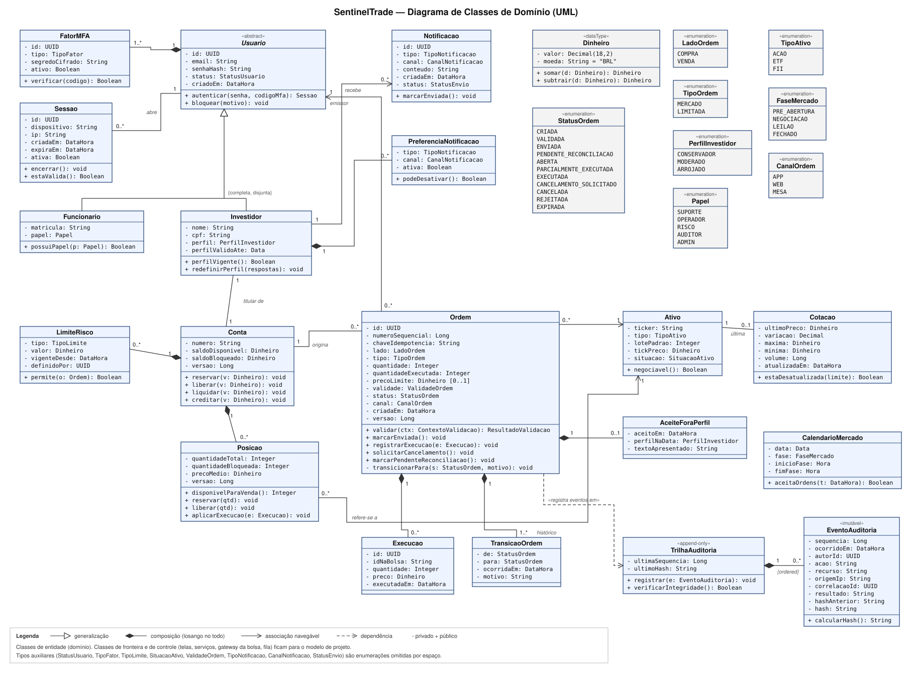

# Modelo de Classes de Domínio (UML) — SentinelTrade

> **Base:** `requisitos.md` e `MCU.md`
>
> **Referência metodológica:** BEZERRA, Eduardo. *Princípios de Análise e Projeto de Sistemas com UML*. O ponto de partida é o cap. 4 (casos de uso), de onde vêm as classes do domínio.

---

## 1. Diagrama

---

## 2. Por que um diagrama de classes de domínio

O MCU descreve **o que** o sistema faz do ponto de vista dos atores. O passo seguinte é descobrir **sobre quais coisas** o sistema precisa guardar informação e aplicar regras. Para isso usamos o **diagrama de classes de domínio**, também chamado de modelo de classes de análise:

- Ele é a visão **estrutural** que complementa a visão **comportamental** do MCU.
- As classes foram identificadas a partir dos **substantivos** que aparecem nas descrições dos casos de uso: ordem, conta, posição, ativo, cotação, limite, notificação, sessão etc.
- Ele mostra apenas **classes de entidade**, isto é, informação que precisa persistir. Classes de fronteira (telas, APIs) e de controle (serviços, gateway da bolsa, fila) ficam para o modelo de projeto, como indica a legenda do diagrama.

A **máquina de estados da ordem** já foi modelada em `requisitos.md` (seção 1.2). Aqui ela aparece na enumeração `StatusOrdem` e no método privado `transicionarPara`.

---

## 3. Classes e responsabilidades

### 3.1 Identidade e acesso

| Classe | Responsabilidade | Casos de uso | Requisitos |
|---|---|---|---|
| `Usuario` «abstract» | Dados comuns de quem entra no sistema: credencial (só o hash), status e autenticação | UC01 | RF-03, RF-05, RNF-SEG-01 |
| `Investidor` | Cliente da corretora, com perfil de suitability e validade do perfil | UC03, UC18 | RF-01, RF-02 |
| `Funcionario` | Usuário interno da Orion, com um `Papel` (suporte, operador, risco, auditor, admin) | UC18–UC24 | RF-05, RNF-SEG-10 |
| `FatorMFA` | Segundo fator de autenticação (TOTP ou push), com segredo cifrado | UC01 | RF-03, RNF-SEG-02 |
| `Sessao` | Sessão aberta em um dispositivo; pode ser encerrada remotamente | UC01, UC02 | RF-04 |

### 3.2 Conta, carteira e risco

| Classe | Responsabilidade | Casos de uso | Requisitos |
|---|---|---|---|
| `Conta` | Saldo **disponível** e **bloqueado**; reservar, liberar, liquidar e creditar | UC05, UC06 | RF-07, RF-16 |
| `Posicao` | Quantidade de um ativo na conta, quantidade bloqueada e preço médio | UC05, UC06 | RF-08, RF-16 |
| `LimiteRisco` | Limite por conta (valor por ordem, exposição diária, concentração) | UC13, UC21 | RF-30 |

### 3.3 Ordem e seu ciclo de vida

| Classe | Responsabilidade | Casos de uso | Requisitos |
|---|---|---|---|
| `Ordem` | Centro do modelo: dados da ordem, estado atual, chave de idempotência, número sequencial e regras de transição | UC06–UC09, UC13, UC14, UC19, UC25–UC27 | RF-12 a RF-22 |
| `Execucao` | Cada negócio (total ou parcial) informado pela bolsa | UC25 | RF-19 |
| `TransicaoOrdem` | Histórico de cada mudança de estado, com motivo e horário | UC09, UC10 | RF-19, RF-26 |
| `AceiteForaPerfil` | Registro da ciência do investidor quando opera fora do perfil | UC12 | RF-15 |

### 3.4 Mercado

| Classe | Responsabilidade | Casos de uso | Requisitos |
|---|---|---|---|
| `Ativo` | Ticker, tipo (ação/ETF/FII), lote, tick de preço e situação (negociável/suspenso) | UC04, UC24 | RF-11 |
| `Cotacao` | Última cotação conhecida e horário da atualização; sabe dizer se está desatualizada | UC04, UC17 | RF-09, RF-10 |
| `CalendarioMercado` | Fases do pregão por dia; responde se o mercado aceita ordens naquele instante | UC13, UC24 | RF-33 |

### 3.5 Notificação e auditoria

| Classe | Responsabilidade | Casos de uso | Requisitos |
|---|---|---|---|
| `Notificacao` | Mensagem enviada ao investidor, com canal e status de envio | UC16 | RF-23, RF-24 |
| `PreferenciaNotificacao` | Escolhas do investidor por tipo e canal; as de segurança não podem ser desativadas | UC11 | RF-25 |
| `TrilhaAuditoria` «append-only» | Mantém a sequência e o último hash; só **acrescenta** eventos e verifica a integridade da cadeia | UC22 | RF-28, RNF-AUD-01 |
| `EventoAuditoria` «imutável» | Um registro de auditoria: quem, o quê, quando, de onde, correlação, resultado e hash encadeado | UC22 | RF-28, RNF-RAS-01 |

### 3.6 Tipos de apoio

| Tipo | Por que existe |
|---|---|
| `Dinheiro` «dataType» | Valor monetário com `Decimal(18,2)` e moeda. Ver justificativa 5.2. |
| `StatusOrdem` «enumeration» | Os 11 estados da máquina de estados, incluindo `PENDENTE_RECONCILIACAO` e `CANCELAMENTO_SOLICITADO`. |
| `LadoOrdem`, `TipoOrdem`, `PerfilInvestidor`, `Papel`, `TipoAtivo`, `FaseMercado`, `CanalOrdem` «enumeration» | Domínios fechados de valores. Tipá-los evita valores inválidos e simplifica a validação de entrada (RNF-SEG-05). |

---

## 4. Relacionamentos e multiplicidades

| Relação | Tipo | Multiplicidade | Leitura |
|---|---|---|---|
| `Investidor`, `Funcionario` → `Usuario` | Generalização `{completa, disjunta}` | — | Todo usuário é investidor **ou** funcionário, nunca os dois. |
| `Usuario` ◆— `FatorMFA` | Composição | 1 — 1..* | Todo usuário tem pelo menos um segundo fator. Sem usuário, o fator não existe. |
| `Usuario` — `Sessao` | Associação "abre" | 1 — 0..* | Um usuário pode ter várias sessões (vários dispositivos). |
| `Investidor` — `Conta` | Associação "titular de" | 1 — 1 | Premissa do escopo: um investidor tem uma conta na Orion. |
| `Investidor` ◆— `PreferenciaNotificacao` | Composição | 1 — 0..* | Preferências pertencem ao investidor. |
| `Investidor` → `Notificacao` | Associação navegável "recebe" | 1 — 0..* | O investidor recebe muitas notificações. |
| `Conta` ◆— `Posicao` | Composição | 1 — 0..* | A carteira é o conjunto de posições da conta. |
| `Conta` ◆— `LimiteRisco` | Composição | 1 — 0..* | Limites são definidos por conta. |
| `Conta` — `Ordem` | Associação "origina" | 1 — 0..* | Toda ordem pertence a exatamente uma conta. |
| `Ordem` → `Usuario` | Associação navegável, papel **emissor** | 0..* — 1 | Quem emitiu a ordem: o próprio investidor ou um operador em contingência (CVM 35). |
| `Ordem` → `Ativo` | Associação navegável | 0..* — 1 | Cada ordem é de um único ativo. |
| `Posicao` → `Ativo` | Associação navegável "refere-se a" | 0..* — 1 | Cada posição é de um único ativo. |
| `Ativo` — `Cotacao` | Associação "última" | 1 — 0..1 | O domínio guarda só a última cotação; o histórico de preços está fora do escopo. |
| `Ordem` ◆— `Execucao` | Composição | 1 — 0..* | Uma ordem pode ter várias execuções parciais. |
| `Ordem` ◆— `TransicaoOrdem` | Composição "histórico" | 1 — 1..* | Toda ordem tem pelo menos a transição inicial (`CRIADA`). |
| `Ordem` ◆— `AceiteForaPerfil` | Composição | 1 — 0..1 | Só existe quando a ordem foi aceita fora do perfil. |
| `TrilhaAuditoria` ◆— `EventoAuditoria` | Composição `{ordered}` | 1 — 0..* | Os eventos formam uma sequência ordenada e encadeada. |
| `Ordem` ⇢ `TrilhaAuditoria` | Dependência «registra eventos em» | — | A ordem **usa** a trilha, mas não guarda referência a ela. |

---

## 5. Justificativa das decisões de modelagem

### 5.1 Atributos privados e operações de negócio (sem *setters*)
**Todos** os atributos são privados (`-`). As classes expõem apenas operações com significado de negócio: `reservar`, `liberar`, `liquidar`, `registrarExecucao`, `solicitarCancelamento`. Não há `setSaldo()` nem `setStatus()`.
- Atende diretamente a **RNF-SEG-04** (atributos privados, lista do professor).
- Garante que **nenhuma parte do sistema altere saldo ou estado sem passar pela regra**. Por exemplo, não dá para "zerar" um saldo bloqueado sem liberar a reserva correspondente.
- `transicionarPara` é **privado** em `Ordem`. As transições só acontecem por meio das operações públicas, e cada uma delas verifica se a transição é permitida pelo diagrama de estados (RNF-RES-07).

### 5.2 `Dinheiro` como tipo de dado, nunca número de ponto flutuante
Todo valor monetário (saldos, preços, limites, tick) usa o tipo `Dinheiro`, com `Decimal(18,2)` e moeda. Números de ponto flutuante acumulam erros de arredondamento. Em um sistema financeiro, isso viola a **integridade** (RNF-INT-01) e gera divergências na reconciliação. O estereótipo «dataType» indica que `Dinheiro` não tem identidade própria: dois valores iguais são o mesmo valor.

### 5.3 `Ordem` como classe central
A pesquisa e os requisitos concluíram que **a ordem é o centro do sistema** (quase todas as dores acontecem no ciclo de vida dela). No diagrama, ela está no meio e é a classe com mais relacionamentos. Alguns atributos existem por causa de requisitos específicos:

| Atributo | Por quê |
|---|---|
| `chaveIdempotencia` | Evita ordem duplicada quando o app reenvia (RF-20, dor D2). |
| `numeroSequencial` | A CVM 35 exige numeração sequencial e cronológica das ordens. |
| `canal` | Distingue ordens do app, da web e da **mesa** (contingência, RF-22). |
| `quantidadeExecutada` | Permite o estado `PARCIALMENTE_EXECUTADA` e o cálculo do saldo a liberar no cancelamento. |
| `precoLimite [0..1]` | Opcional: só existe em ordem limitada. A multiplicidade deixa isso explícito. |
| `versao` | Controle de concorrência otimista (ver 5.5). |

### 5.4 `Execucao` e `TransicaoOrdem` separadas da `Ordem`
- **`Execucao`** é uma classe à parte porque uma ordem pode ser executada **em várias partes**, com preços diferentes. Guardar só "preço executado" na ordem perderia informação e impediria calcular o preço médio da posição.
- **`TransicaoOrdem`** guarda cada mudança de estado com horário e motivo. É ela que alimenta a linha do tempo do UC09 (dor D3: "o que aconteceu com minha ordem?") e o comprovante do UC15.
- Ambas são **composição** porque não fazem sentido sem a ordem a que pertencem.

### 5.5 Reserva atômica e atributo `versao`
`Conta` separa `saldoDisponivel` de `saldoBloqueado`, e `Posicao` separa `quantidadeTotal` de `quantidadeBloqueada`. Isso implementa a **reserva** do RF-16: ao validar, o valor passa de disponível para bloqueado. Duas ordens simultâneas não conseguem usar o mesmo dinheiro.

O atributo `versao` em `Conta`, `Posicao` e `Ordem` representa o **controle de concorrência otimista** do RNF-RES-07: se duas operações tentarem alterar o mesmo registro ao mesmo tempo, apenas uma vence e a outra é refeita. Ele foi incluído já na análise porque a consistência do saldo é uma **regra de negócio**, não apenas um detalhe de implementação.

### 5.6 `Usuario` abstrato com generalização `{completa, disjunta}`
Investidor e funcionário compartilham credencial, MFA e sessão, mas têm dados e permissões diferentes. A generalização evita duplicar a parte de autenticação.
- `{completa}`: não existe "usuário genérico"; todo usuário é de um dos dois tipos. Por isso `Usuario` é abstrata (nome em itálico).
- `{disjunta}`: ninguém é investidor e funcionário ao mesmo tempo. Isso apoia a regra de que pessoas vinculadas à corretora seguem regras próprias (CVM 35).

### 5.7 Papéis internos como enumeração, não como subclasses
Suporte, Operador, Risco, Auditor e Admin **não** viraram cinco subclasses de `Funcionario`, por três motivos:
- eles **não têm atributos diferentes**, só permissões diferentes;
- o papel de uma pessoa pode mudar (um analista é promovido), e mudar de subclasse não é natural em orientação a objetos;
- o controle de acesso por perfil (RF-05) é uma questão de **autorização**, melhor representada por um valor (`Papel`) consultado por `possuiPapel()`.

Isso é coerente com o MCU, onde os papéis também não foram generalizados (ver `MCU.md`, 6.2).

### 5.8 Emissor da ordem associado a `Usuario`, não a `Investidor`
A associação "emissor" aponta para `Usuario`, a superclasse, e não para `Investidor`. Na contingência (UC19), quem emite a ordem é um **operador**, em nome do cliente. A CVM 35 exige identificar o emissor. Se a associação apontasse para `Investidor`, o modelo não conseguiria registrar a ordem da mesa corretamente. A **conta** diz de quem é o dinheiro; o **emissor** diz quem deu a ordem.

### 5.9 `Cotacao` com `atualizadaEm` e `estaDesatualizada()`
A cotação sabe a própria idade. Isso coloca a regra do RF-10 ("não confiar em preço velho") **no objeto que tem a informação**, e não espalhada pela tela ou pela validação. A associação com `Ativo` é 0..1 porque um ativo recém-cadastrado pode ainda não ter cotação. O histórico de preços não é responsabilidade deste domínio.

### 5.10 Auditoria com cadeia de hashes e referências por identificador
- `TrilhaAuditoria` é «append-only»: só tem `registrar()` e `verificarIntegridade()`. Não há operação de alterar ou apagar.
- Cada `EventoAuditoria` é «imutável» e guarda `hashAnterior` e `hash`. Isso forma uma **cadeia**: alterar um evento antigo quebraria todos os hashes seguintes, e `verificarIntegridade()` detecta isso (RNF-AUD-01).
- `EventoAuditoria` aponta para quem agiu por **identificador** (`autorId: UUID`), e não por associação com `Usuario`. Da mesma forma, `LimiteRisco` guarda `definidoPor: UUID`. Foi uma decisão deliberada: o log fica em **armazenamento separado** (RNF-AUD-02) e precisa continuar válido mesmo se um usuário for inativado ou se os dados pessoais forem mascarados (LGPD). Uma associação direta acoplaria o log ao cadastro.
- `correlacaoId` liga eventos de vários serviços à mesma operação (RNF-RAS-01, dor D10).

### 5.11 Dependência (e não associação) entre `Ordem` e `TrilhaAuditoria`
A ordem **usa** a trilha para registrar eventos, mas não precisa guardar uma referência permanente a ela. Por isso a relação é uma **dependência** (linha tracejada). Isso também mostra que a auditoria é uma preocupação transversal, coerente com a decisão do MCU de não desenhar "Registrar auditoria" como caso de uso (`MCU.md`, 6.10). Outras classes (`Conta`, `LimiteRisco`, `Sessao`) também geram eventos. Só a dependência da `Ordem` foi desenhada, para não poluir o diagrama.

### 5.12 Composição × associação
Composição (◆) foi usada **apenas** quando a parte não existe sem o todo e é criada e removida junto com ele:
- `FatorMFA` e `PreferenciaNotificacao` pertencem ao usuário;
- `Posicao` e `LimiteRisco` pertencem à conta;
- `Execucao`, `TransicaoOrdem` e `AceiteForaPerfil` pertencem à ordem;
- `EventoAuditoria` pertence à trilha.

`Ordem` **não** está em composição com `Conta`. Embora toda ordem tenha uma conta, a ordem precisa sobreviver independentemente para fins regulatórios: uma conta inativada continua com suas ordens no histórico (RF-01 proíbe exclusão física). Por isso a relação é uma associação simples.

### 5.13 Navegabilidade
Só foram desenhadas setas de navegação onde a direção é clara e importante:
- `Ordem → Ativo` e `Posicao → Ativo`: o ativo não precisa conhecer todas as ordens e posições que o referenciam.
- `Ordem → Usuario` (emissor): o usuário não precisa listar as ordens que emitiu; quem faz essa consulta é a auditoria.
- `Investidor → Notificacao`.

As demais associações ficam sem direção definida, o que é adequado no nível de análise. A navegabilidade completa é decidida no projeto.

---

## 6. Como o modelo atende aos casos de uso críticos

| Caso de uso | Classes envolvidas | Operações-chave |
|---|---|---|
| UC06 Enviar ordem | `Investidor`, `Conta`, `Posicao`, `Ordem`, `Ativo`, `Cotacao`, `LimiteRisco`, `CalendarioMercado`, `AceiteForaPerfil` | `Ordem.validar()`, `Conta.reservar()`, `Posicao.reservar()` |
| UC13 Validar ordem | `Ordem`, `Conta`, `Posicao`, `LimiteRisco`, `Ativo`, `CalendarioMercado`, `Investidor` | `LimiteRisco.permite()`, `Ativo.negociavel()`, `CalendarioMercado.aceitaOrdens()`, `Investidor.perfilVigente()` |
| UC14 Transmitir à bolsa | `Ordem`, `TransicaoOrdem` | `Ordem.marcarEnviada()`, `Ordem.marcarPendenteReconciliacao()` |
| UC25 Processar retorno | `Ordem`, `Execucao`, `Posicao`, `Conta`, `Notificacao` | `Ordem.registrarExecucao()`, `Posicao.aplicarExecucao()`, `Conta.liquidar()` |
| UC26 Reconciliar ordens | `Ordem`, `Execucao`, `TransicaoOrdem` | `Ordem.registrarExecucao()` ou rejeição e liberação de reserva |
| UC08 Cancelar ordem | `Ordem`, `Conta`/`Posicao` | `Ordem.solicitarCancelamento()`, `liberar()` |
| UC22 Consultar auditoria | `TrilhaAuditoria`, `EventoAuditoria` | `TrilhaAuditoria.verificarIntegridade()` |

---

## 7. Fora deste diagrama (próximas etapas)

- **Classes de fronteira e de controle**: telas, API, serviço de validação, gateway da bolsa, consumidor da fila, disjuntor. Pertencem ao modelo de projeto.
- **Diagramas de sequência** para UC06 e UC14, mostrando a colaboração entre as classes acima e os mecanismos de resiliência.
- **Diagrama de estados** formal em UML para `Ordem`, a partir do rascunho em Mermaid de `requisitos.md`.
- Enumerações auxiliares (`StatusUsuario`, `TipoFator`, `TipoLimite`, `SituacaoAtivo`, `ValidadeOrdem`, `TipoNotificacao`, `CanalNotificacao`, `StatusEnvio`) foram citadas mas não desenhadas, por espaço.